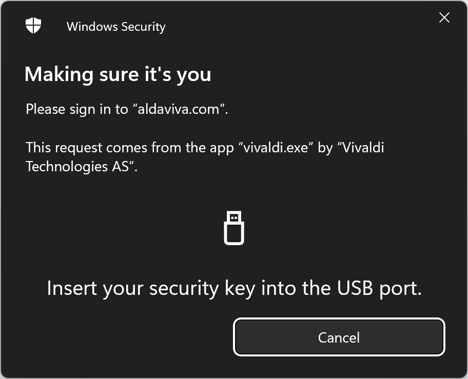
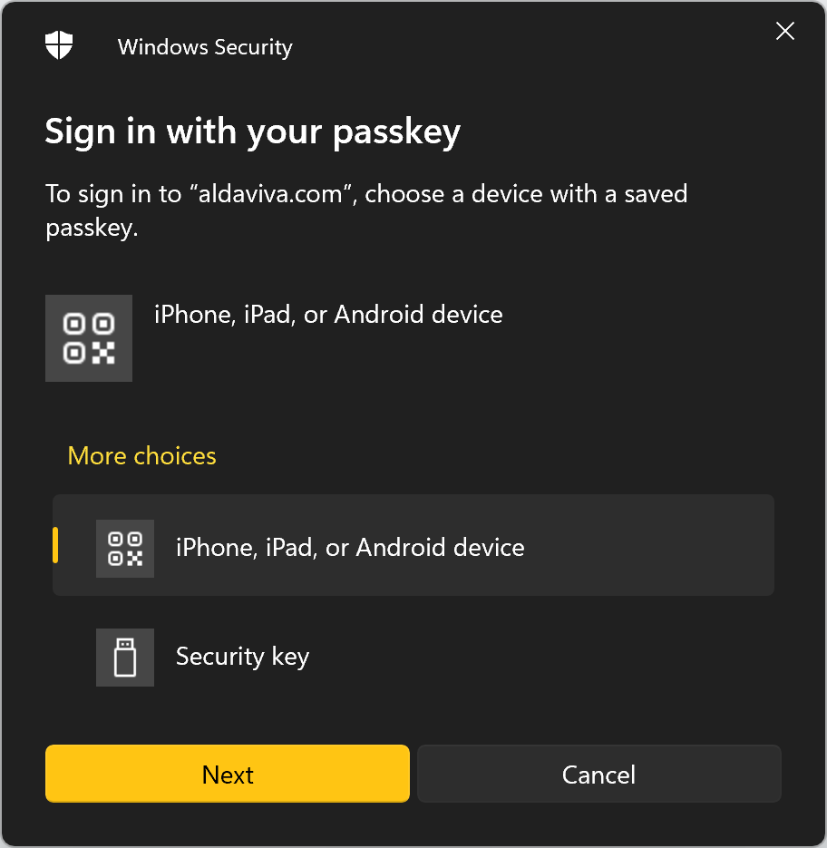
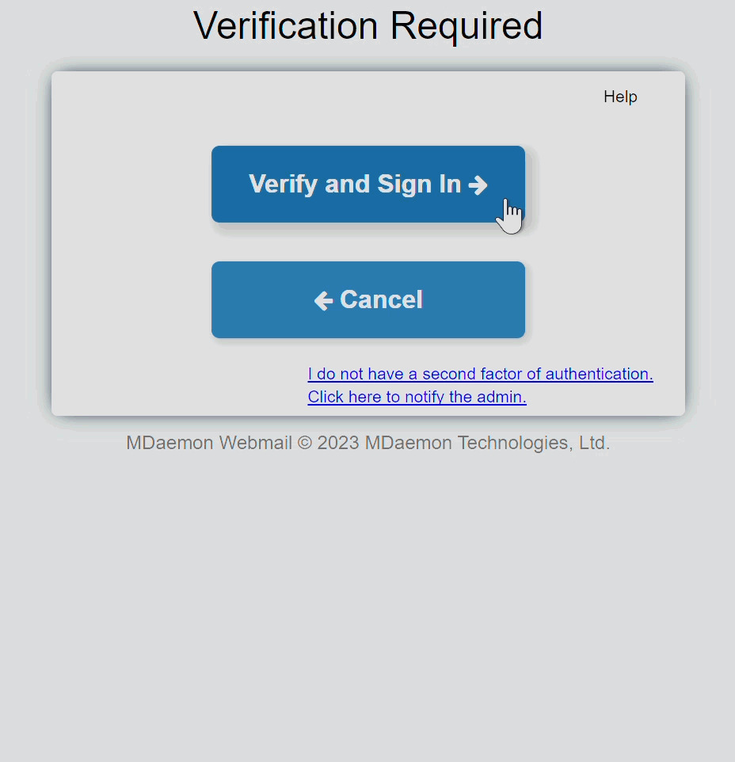

 AuthenticatorChooser
===

[](https://github.com/Aldaviva/AuthenticatorChooser/releases) [](https://github.com/Aldaviva/AuthenticatorChooser/actions/workflows/dotnet.yml)

*Background program that skips the phone pairing option and chooses the USB security key in Windows FIDO/WebAuthn prompts.*

<!-- MarkdownTOC autolink="true" bracket="round" autoanchor="false" levels="1,2" -->

- [Problem](#problem)
- [Solution](#solution)
- [Requirements](#requirements)
- [Installation](#installation)
- [Demo](#demo)
- [Building](#building)
- [Related](#related)

<!-- /MarkdownTOC -->

## Problem

Windows can display a Windows Security credential prompt when requested by a program, such as a browser with WebAuthn. This allows you to authenticate using a FIDO authenticator, such as a USB security key or a passkey in your computer's TPM protected by a Windows Hello PIN or biometrics, like a fingerprint.

In Windows 10 and 11 prior to 22H2 Moment 4 (September 2023), if the TPM contains the private key needed to authenticate to the relying party (like a website), Windows will prioritize prompting for the user's challenge (like a PIN or fingerprint) for this TPM authenticator first. Windows will still provide an option to choose a different authenticator (like a USB security key) with an additional click. Otherwise, if the TPM does not contain the required secret, Windows will immediately prompt you to insert a USB security key.

<p align="center"></p> 

In Windows 11 [22H2 Moment 4](https://www.bleepingcomputer.com/news/microsoft/windows-11-moment-4-update-released-here-are-the-many-new-features/) (September 2023) and later (including [23H2](https://www.bleepingcomputer.com/news/microsoft/windows-11-23h2-new-features-in-the-windows-11-2023-update/)), this behavior changed to include the ability to pair with Android and iOS devices over Bluetooth to use their passkeys, which somewhat ameliorates the problem of passkeys not being portable outside their TPM. The behavior is unchanged if the Windows TPM contains the passkey. However, if the local TPM does not contain the passkey, an additional "Sign in with your passkey"/"Choose a passkey" step was added before you can use your USB security key.

Now it says "To sign in to “`domain`”, choose a device with a saved passkey," and you have to choose whether you want to use an "iPhone, iPad, or Android device" or a "Security key," and phone is the default choice. Choosing the USB security key requires two additional clicks or four additional keystrokes. It is impossible to opt out of this new prompt, even if you turn off Bluetooth, don't have an Android or iOS device, or never want to use it for FIDO authentication on your Windows computer. Windows does not remember the most recently used choice, either. You could disable your Bluetooth device in Device Manager, but this will also prevent you from using any other Bluetooth peripherals with your computer, such as Bluetooth mice, keyboards, headphones, speakers, and proximity location trackers.

<p align="center"></p>

## Solution

This is a background program that runs headlessly in your Windows user session. It waits for Windows FIDO credential provider prompts to appear, then chooses the Security Key option and clicks Next for you automatically. From the user's perspective, the Bluetooth screen barely even appears before it's replaced with the prompt to plug in your USB security key.

<p align="center"></p>     

Internally, this program uses [Microsoft UI Automation](https://learn.microsoft.com/en-us/windows/win32/winauto/uiauto-uiautomationoverview) to read and interact with the dialog boxes.

### Overriding the automatic next behavior

By default, this program does not interfere with local TPM passkey prompts (like requesting your Windows Hello PIN or biometrics). It also does not automatically submit FIDO prompts that contain additional options besides a USB security key and pairing a new Bluetooth smartphone, such as the cases when you already have a paired phone, or you previously declined a Windows Hello factor like a PIN but want to try a PIN again from the authenticator choice dialog. However, you may override this behavior if you wish and force it to **_always_** choose the USB security key in all cases, even if there are other valid options like Windows Hello PIN/biometrics, by passing the command-line argument `--skip-all-non-security-key-options` when starting this program (see [Installation](#installation) for the recommended autostart registry paths if you want to change it there).

If a paired phone option appears in the dialog box and you want to remove it, [you can edit the registry to unpair an existing phone](https://github.com/Aldaviva/AuthenticatorChooser/wiki/Unpairing-Bluetooth-smartphone). This is useful if your old phone [bricked itself](https://en.wikipedia.org/wiki/Pixel_5a#Known_issues), or if you just upgraded to a new phone.

If this program skips the authenticator choice dialog when you don't want it to, for example, if you want to use a smartphone Bluetooth passkey only once or infrequently, you can hold <kbd>Shift</kbd> when the dialogs appear to temporarily suppress this program from automatically submitting the security key choice once.

Even if this program doesn't click the Next button (because an extra choice was present, or you were holding <kbd>Shift</kbd>), it will still highlight the Security Key option and focus the Next button for you, so you can just press <kbd>Enter</kbd> or <kbd>Space</kbd> to choose the Security Key anyway.

## Requirements

- Windows 11 25H2, 24H2, 23H2, or [22H2 Moment 4](https://support.microsoft.com/en-us/topic/september-26-2023-kb5030310-os-build-22621-2361-preview-363ac1ae-6ea8-41b3-b3cc-22a2a5682faf)
- [.NET Desktop Runtime 8](https://dotnet.microsoft.com/en-us/download/dotnet/8.0/runtime) or later, either x64 or arm64
- When using Windows over Remote Desktop Connection, this program must run on the client, not the server, because FIDO prompts are forwarded and displayed by the client outside of the `mstsc` window

## Installation

1. [Download the latest release ZIP archive for your CPU architecture.](https://github.com/Aldaviva/AuthenticatorChooser/releases/latest)
1. Extract the `AuthenticatorChooser.exe` file from the ZIP archive to a directory of your choice, like `C:\Program Files\AuthenticatorChooser\`.
1. Run the program by double-clicking `AuthenticatorChooser.exe`.
    - Nothing will appear because it's a background program with no UI, but you can tell it's running by searching for `AuthenticatorChooser` in Task Manager.
1. Register the program to run automatically on user logon with **any one** of the following techniques. Be sure to change the example path below if you chose a different installation directory in step 2. If you'd like to specify additional [command-line arguments](https://github.com/Aldaviva/AuthenticatorChooser/wiki/Command%E2%80%90line-arguments) like `--skip-all-non-security-key-options`, you can do that here too.
    - Run this program once with the `--autostart-on-logon` argument
        ```ps1
        .\AuthenticatorChooser --autostart-on-logon
        ```
    - Add a shortcut to `AuthenticatorChooser.exe` in the Startup folder (`%APPDATA%\Microsoft\Windows\Start Menu\Startup\`)
    - Import a `.reg` file
        ```reg
        Windows Registry Editor Version 5.00

        [HKEY_CURRENT_USER\Software\Microsoft\Windows\CurrentVersion\Run]
        "AuthenticatorChooser"="\"C:\\Program Files\\AuthenticatorChooser\\AuthenticatorChooser.exe\""
        ```
    - Run a Command Prompt command
        ```bat
        reg add HKCU\Software\Microsoft\Windows\CurrentVersion\Run /v AuthenticatorChooser /d """C:\Program Files\AuthenticatorChooser\AuthenticatorChooser.exe"""
        ```
    - Run a PowerShell cmdlet
        ```ps1
        Set-ItemProperty -Path HKCU:\Software\Microsoft\Windows\CurrentVersion\Run -Name AuthenticatorChooser -Value """C:\Program Files\AuthenticatorChooser\AuthenticatorChooser.exe"""
        ```
    - Use `regedit.exe` interactively to go to the `HKEY_CURRENT_USER\Software\Microsoft\Windows\CurrentVersion\Run` key, and then add a new String value with the Name `AuthenticatorChooser` and the Value `"C:\Program Files\AuthenticatorChooser\AuthenticatorChooser.exe"`

## Demo

To test with a sample FIDO authentication prompt, visit [WebAuthn.io](https://webauthn.io) and click the **Authenticate** button.

## Building

If you want to build this application yourself instead of downloading precompiled binaries from the [releases](https://github.com/Aldaviva/AuthenticatorChooser/releases) page, you can follow these steps.

1. Install the [latest stable .NET SDK](https://dotnet.microsoft.com/en-us/download) (8 or later).
1. Clone this repository.
    ```ps1
    git clone "https://github.com/Aldaviva/AuthenticatorChooser.git"
    ```
1. Go to the project directory.
    ```ps1
    cd .\AuthenticatorChooser\AuthenticatorChooser\
    ```
1. Choose one of the [version tags](https://github.com/Aldaviva/AuthenticatorChooser/tags) to build, or skip this step to use the head commit on the `master` branch.
    ```sh
    git checkout 0.5.0
    ```
1. Build the program.
    ```ps1
    dotnet publish -p:PublishSingleFile=true
    ```

The program will be compiled to the following path, assuming your CPU architecture is x64.
```text
.\bin\Release\net8.0-windows\win-x64\publish\AuthenticatorChooser.exe
```

You can also use an IDE like [Visual Studio](https://visualstudio.microsoft.com/vs/) Community 2022 or 2026 instead of the command line if you prefer.

- Visual Studio Publishing Profiles have been [broken for years](https://developercommunity.visualstudio.com/t/Trying-to-publish-to-a-folder-only-build/10905900) unless certain other workloads (like ASP.NET Web Development) are installed, so if you can't publish from VS you'll have to use the `dotnet publish` command above.

## Related

### Creating new passkeys
When you try to create a passkey in your browser, the website may force it to be stored only in the TPM or only on a security key, rather than letting you freely choose between the two destinations. To override the site's mandate and put yourself back in control of where your new passkey will be saved, you can install my [**Create Passkeys Anywhere** user script](https://github.com/Aldaviva/userscripts/raw/master/create-passkeys-anywhere.user.js) (requires [Tampermonkey](https://tampermonkey.net/) or a similar browser extension). It doesn't only run on Windows, for example it also works on Firefox for Android.

With this script installed, you will by default always be asked whether to save each new passkey on a security key or in the TPM. If you want to override this behavior, you can also configure the user script by editing the `options.allowedPasskeyCreationStorage` value in the script source. If you change it from `anywhere` to `securityKey`, it will only allow you to save new passkeys on security keys, and if you change it to `tpm`, it will only allow them to be saved in the TPM.
